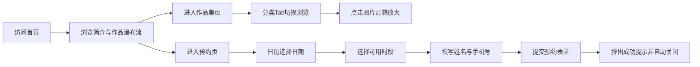

## 1. 产品概述
摄影工作室在线预约小站，提供作品集浏览与在线预约服务，面向需要婚纱、写真、证件照拍摄的个人客户。

- 解决客户线下咨询繁琐、预约不便的痛点，提升工作室品牌形象与获客效率
- 目标用户：20-40岁有拍摄需求的城市人群，兼顾PC与移动端浏览体验

## 2. 核心功能

### 2.1 功能模块
1. **首页**：工作室简介 + 精选作品瀑布流展示
2. **预约页**：日历选日期 + 时段卡片选择 + 姓名电话表单提交
3. **作品集页**：分类Tab切换（婚纱/写真/证件照） + 灯箱放大浏览

### 2.2 页面详情
| 页面名称 | 模块名称 | 功能描述 |
|---------|---------|---------|
| 首页 | 导航栏 | 固定吸顶，移动端汉堡菜单，三页切换 |
| 首页 | 工作室简介 | Banner区域展示工作室名称、Slogan、简短介绍 |
| 首页 | 精选作品瀑布流 | 两列/一列响应式瀑布流，展示代表作缩略图 |
| 预约页 | 日历组件 | 月视图日历，点击选中日期，禁用已过期日期 |
| 预约页 | 时段卡片 | 上午/下午/晚间时段卡片，已约满灰掉不可点击 |
| 预约页 | 预约表单 | 姓名、手机号输入校验，提交按钮 |
| 预约页 | 成功提示 | 提交后弹出成功Toast，自动关闭 |
| 作品集页 | 分类Tab | 婚纱/写真/证件照三类切换，带下划线动画 |
| 作品集页 | 图片网格 | 响应式网格展示作品缩略图 |
| 作品集页 | 灯箱组件 | 点击图片全屏放大，左右箭头翻页，ESC/点击遮罩关闭 |

## 3. 核心流程
用户访问小站 → 浏览首页精选作品与简介 → 点击导航进入作品集页分类浏览 → 进入预约页选择日期和时段 → 填写姓名电话提交 → 弹出预约成功提示

## 4. 用户界面设计
### 4.1 设计风格
- 主色：奶白色 `#FAFAF8`（页面背景）
- 强调色：复古棕 `#8B7355`（按钮、链接、选中态、导航高亮）
- 辅助色：浅灰 `#E8E4DE`（卡片边框、分隔线）、深棕 `#5C4A36`（正文文字）
- 按钮风格：圆角8px，复古棕填充/描边，hover轻微加深
- 字体：标题用「思源宋体」「Noto Serif SC」衬线体体现文艺感，正文用无衬线体
- 布局：卡片式布局，大量留白营造高级感
- 图标风格：线性极简图标

### 4.2 页面设计概览
| 页面名称 | 模块名称 | UI元素 |
|---------|---------|--------|
| 首页 | 简介区 | 大号衬线标题、副标题、复古棕装饰分割线 |
| 首页 | 瀑布流 | 两列不等高图片卡片，圆角8px，hover微缩放 |
| 预约页 | 日历 | 月份切换按钮、选中日期复古棕圆形高亮、周末浅灰标注 |
| 预约页 | 时段卡 | 3列网格、可用态白底棕框、已选棕底白字、满约灰底灰字 |
| 作品集页 | Tab栏 | 下划线跟随切换动画 |
| 作品集页 | 灯箱 | 半透明黑色遮罩、图片居中、左右半透明箭头按钮 |

### 4.3 响应式
- Desktop-first 设计，断点 768px
- PC端：导航水平展开、瀑布流两列、作品集三列
- 移动端（<768px）：导航汉堡菜单、瀑布流单列、作品集两列、日历单月紧凑显示
