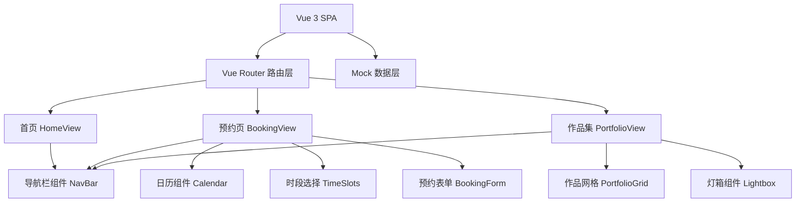

## 1. 架构设计


## 2. 技术说明
- 前端：Vue 3 + Vite + Vue Router 4
- 构建工具：Vite 5
- 样式：原生 CSS3（CSS 变量 + Flex/Grid + @media）
- 状态管理：Vue 3 组合式 API（ref/reactive），无需 Pinia
- 数据：本地 Mock JSON 数据，无后端
- 图标：内联 SVG

## 3. 路由定义
| 路由 | 用途 |
|------|------|
| / | 首页：工作室简介 + 精选瀑布流 |
| /booking | 预约页：日历 + 时段 + 表单 |
| /portfolio | 作品集页：分类Tab + 灯箱 |

## 4. 目录结构
```
project41/
├── src/
│   ├── main.js
│   ├── App.vue
│   ├── router/
│   │   └── index.js
│   ├── data/
│   │   └── mock.js
│   ├── views/
│   │   ├── HomeView.vue
│   │   ├── BookingView.vue
│   │   └── PortfolioView.vue
│   ├── components/
│   │   ├── NavBar.vue
│   │   ├── Calendar.vue
│   │   ├── TimeSlots.vue
│   │   ├── BookingForm.vue
│   │   ├── PortfolioGrid.vue
│   │   └── Lightbox.vue
│   └── styles/
│       └── global.css
├── index.html
├── package.json
└── vite.config.js
```
